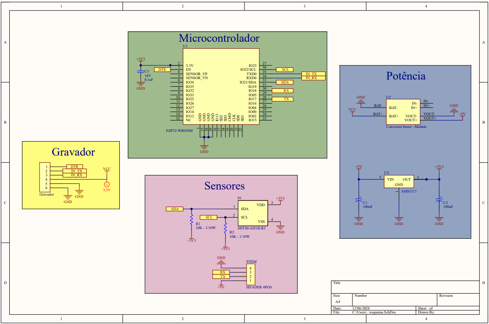
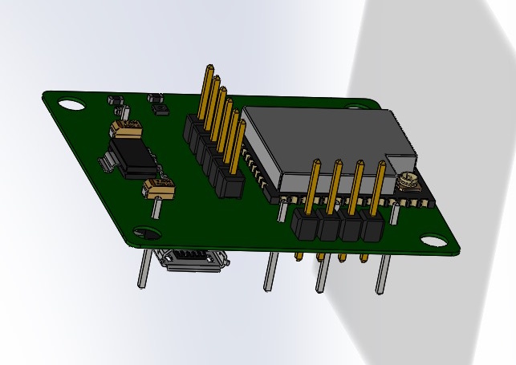
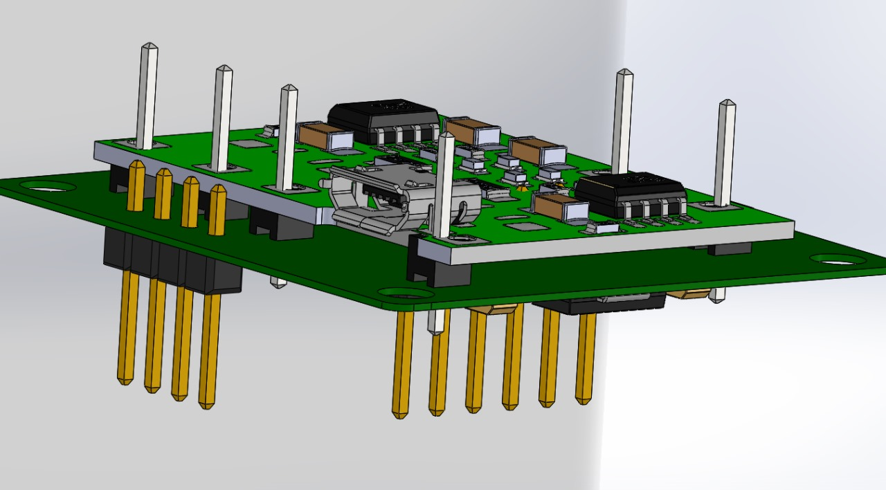
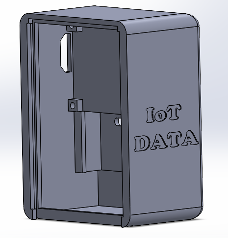
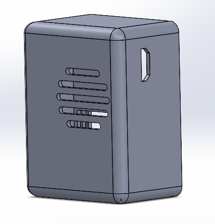
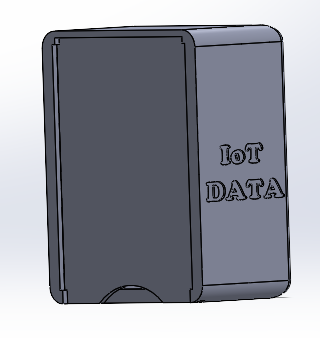

# Introdução

Esse documento busca apresentar os resultados obtidos a partir da demanda de Case para Técnico de Laboratório, especificamente focado na implementação de um Firmware em Laboratório de Eletrônica. Os requisitos solicitados incluíram a criação de um sistema de automação para o monitoramento de temperatura ambiente, umidade, corrente e tensão de alimentação para um painel de servidores.

# Descrição da Atividade

A empresa IoT DATA recebeu um desafio de um de seus mais importantes clientes para desenvolver um hardware embarcado inteligente que utiliza leituras de temperatura ambiente, umidade, corrente e tensão de alimentação do painel dos servidores para prever possíveis falhas na infraestrutura de um data center. O engenheiro responsável pelo desenvolvimento de sistemas embarcados da IoT DATA solicitou seu apoio, como técnico de laboratório alocado no time de P&D, para auxiliar no desenvolvimento e testes do produto.

## Requisitos do projeto

- Dimensões máximas do hardware: 6x4 cm
- Utilização de um ESP-32 como microcontrolador
- Alimentação do circuito por bateria
- Inclusão de pelo menos:
  - Um sensor de temperatura (-10°C a 100°C)
  - Um sensor de umidade
  - Um sensor de corrente (0,5 A a 100 A)
  - Um sensor de tensão (127/220V - 60Hz)
- Os dados coletados devem ser transmitidos para um servidor via Wi-Fi utilizando o protocolo MQTT.

# Pesquisa e escolha dos sensores para o projeto

Durante os primeiros dias da atividade, foram levantados diversos sensores de temperatura, umidade, corrente e tensão a partir de pesquisas realizadas na internet. De acordo com o problema proposto, as fontes mais relevantes usadas durante essa etapa da atividade foram: (1) as especificações técnicas dos produtos disponíveis no mercado, (2) os manuais e datasheets dos componentes, (3) artigos e vídeos do YouTube sobre a implementação de tais sensores em projetos de automação industrial, e (4) conhecimento prévio e experiência adquirida no ambiente profissional. As seções abaixo detalharão cada aspecto dos componentes levantados na pesquisa, e os _tradeoffs_ envolvidos.

## Pesquisa dos sensores

### Sensor de Tensão

- PZEM-004T
  - Faixa de operação: 80-260V, AC
  - Precisão: ±1%
  - Interface: MODBUS
  - Tipo de encapsulamento: Módulo
  - Custo: R$80,00
  - Detalhes adicionais: Funcionalidade dupla
- HLW8012
  - Faixa de operação: 100-250V
  - Precisão: Alta precisão
  - Interface: SPI
  - Tipo de encapsulamento: SMD
  - Custo: R$25,00
  - Detalhes adicionais: Nenhum detalhe
- LV25-P
  - Faixa de operação: ±500V
  - Precisão: ±0,5%
  - Interface: Analogica
  - Tipo de encapsulamento: PTH
  - Custo: R$120,00
  - Detalhes adicionais: Podemos observar que este sensor é o mais caro dentre as opções acima, porém obtém a precisão mais alta. Esse detalhe pode ser um _tradeoff_ no projeto, pois o valor pode não justificar a compra, mesmo que seja o sensor mais preciso.

### Sensor de Corrente

- PZEM-004T
  - Faixa de operação: 80-260V, AC
  - Precisão: ±1%
  - Interface: MODBUS
  - Tipo de encapsulamento: Módulo
  - Custo: R$80,00
  - Detalhes adicionais: É o mesmo sensor para tensão, por apresentar duas funcionalidades distintas: a medição de corrente e tensão no mesmo produto. Por isso, é uma solução atraente.
- ACS712
  - Faixa de operação: ±30A
  - Precisão: ±1.5%
  - Interface: Analógica
  - Tipo de encapsulamento: PTH
  - Custo: R$30,00
  - Detalhes adicionais: Compacto, ideal para montagem em PCB.
- SCT-013
  - Faixa de operação: 0.5-100A
  - Precisão: ±3% (dependente)
  - Interface: Analógica
  - Tipo de encapsulamento: Externo
  - Custo: R$45,00
  - Detalhes adicionais: Não invasivo, mas ocupa mais espaço e é externo.
- INA219
  - Faixa de operação: Até 3.2A
  - Precisão: Alta precisão
  - Interface: I2C
  - Tipo de encapsulamento: SMD
  - Custo: R$35,00
  - Detalhes adicionais: Limitado para baixas correntes, mas compacto.

### Sensor de Temperatura

- DS18B20
  - Faixa de operação: -55°C a 125°C
  - Precisão: ±0.5°C
  - Interface: 1-Wire (One-Wire)
  - Encapsulamento: SMD
  - Custo: R$15,00
  - Detalhes adicionais: Escolha interessante para PCBs, apresenta baixo consumo e simples de integrar.
- DHT22
  - Faixa de operação: -40°C a 80°C
  - Precisão: ±0.5°C
  - Interface: Digital
  - Encapsulamento: PTH
  - Custo: R$30,00
  - Detalhes adicionais: Mede também umidade, mas consome mais energia.
- SHT40
  - Faixa de operação: -55°C a 150°C
  - Precisão: ±1°C
  - Interface: I2C
  - Encapsulamento: SMD
  - Custo: R$60,00
  - Detalhes adicionais: Escolhido pela integração com umidade.

### Sensor de Umidade

- SHT31
  - Faixa de operação: 0% a 100% UR
  - Precisão: ±2% UR
  - Interface: I2C
  - Encapsulamento: SMD
  - Custo: R$50,00
  - Detalhes adicionais: Compacto, confiável e ideal para integração em PCB.
- DHT22
  - Faixa de operação: 0% a 100% UR
  - Precisão: ±2% UR
  - Interface: Digital
  - Encapsulamento: PTH
  - Custo: R$30,00
  - Detalhes adicionais: Versátil, mas consome mais energia.
- HIH6130
  - Faixa de operação: 0% a 100% UR
  - Precisão: ±1,8% UR
  - Interface: I2C
  - Encapsulamento: SMD
  - Custo: R$70,00
  - Detalhes adicionais: Alta precisão, mas custo mais elevado.
- SHT40
  - Faixa de operação: -55°C a 150°C
  - Precisão: ±1°C
  - Interface: I2C
  - Encapsulamento: SMD
  - Custo: R$60,00
  - Detalhes adicionais: Escolhido pela integração com temperatura.

## Sensores escolhidos

Como especificado nos requisitos do projeto, a atividade contará com um microcontrolador ESP-32, e que deve alimentar os componentes. Com base nisso, foram escolhidos os seguintes sensores com base nos pontos levantados: o sensor de temperatura e umidade **SHT40** e o sensor de tensão e corrente **PZEM-004T**.

O motivo da escolha dos sensores anteriormente citados está relacionado aos requisitos do projeto, aos custos dos componentes e à integração com o microcontrolador escolhido (ESP-32), além de considerar outros requisitos não explicitamente mencionados: **precisão, baixo consumo**, e **simplicidade de integração**. Além disso, os valores encontrados em relação aos sensores podem variar, por isso foram tomados como exemplo apenas para fins da atividade. Observamos, a partir dos sensores apresentados, que existe a possibilidade de implementar também o DHT22 e o ACS712, que também são cenários possíveis da atividade.

# Elaboração do circuito

A partir do momento em que os sensores foram escolhidos, foi possível criar o circuito. O esquemático abaixo detalhará como foi projetado o sistema.

A figura representa um sistema centrado em um microcontrolador ESP32-WROOM, dividido em quatro seções principais: Microcontrolador, Alimentação, Sensores e Gravador. O bloco do microcontrolador destaca o módulo ESP32, alimentado por uma fonte de 3,3V com um capacitor de desacoplamento para estabilização. Ele inclui pinos importantes como DTR, TX/RX para comunicação serial e SCL, SDA para comunicação I2C.

A seção de alimentação garante uma fonte de alimentação estável para o sistema. Um conversor de elevação de tensão recebe entrada de uma bateria (BAT+ e BAT-) e produz 5V. Isso é então regulado para 3,3V usando um regulador de tensão AMS1117, apoiado por capacitores de entrada e saída para estabilidade. Essa configuração de dupla tensão fornece energia tanto para o ESP32 quanto para periféricos externos, como sensores.

O bloco de sensores incorpora dois dispositivos: um sensor de umidade e temperatura SHT40, conectado via barramento I2C com resistores de pull-up, e um sensor PZEM para medir parâmetros elétricos, que se comunica através de UART (TX/RX). Finalmente, a seção do gravador fornece uma interface de conexão para carregar firmware no ESP32 via comunicação serial.

As figuras acima representam a configuração física da placa.

# Escolha da bateria

Com o circuito e os componentes escolhidos, o foco foi centralizado na escolha da bateria para alimentar o ESP32 e os sensores. A bateria deve atender aos requisitos de capacidade, tempo de carregamento e especificações para o trabalho a ser desenvolvido. O principal desafio aqui é encontrar uma bateria que seja capaz de alimentar o ESP32 por um período de tempo longo, para garantir que o sensor permaneça ativado durante a medição.

## Bateria escolhida

Para selecionar a bateria mais adequada, utilizamos uma abordagem de análise multicritério. Com base nas informações do circuito e nos requisitos do projeto, pesquisamos entre diferentes fabricantes de baterias para identificar as opções mais apropriadas. Em seguida, aplicamos a técnica de análise multicritério, atribuindo pesos a diversos fatores relevantes, como tempo de duração da carga, custo, tipo de composição química da bateria e outros parâmetros essenciais. Essa técnica nos permitiu determinar a bateria ideal considerando os requisitos previamente definidos.

No entanto, devido à falta de informações detalhadas sobre alguns desses parâmetros, como a autonomia desejada, o custo máximo aceitável e o tipo preferido de composição química da bateria, não foi possível realizar uma definição completa da bateria. Portanto, a especificação inicial poderá ser revisada conforme novas informações forem disponibilizadas.

As principais características exploradas nas pesquisas foram: (1) corrente e capacidade da bateria, (2) custo e valor por dólar, (3) tempo de autonomia, (4) vida útil em ciclos, (5) tipo químico da bateria, (6) autonomia, e (7) espaço físico exigido.

Dentre as baterias pesquisadas, a que mais se aproximou dos requisitos foi a bateria **104060 LITH-ION 3,7V 3AH**, estando disponível para consulta na internet em sites especializados, como a Digikey.

# Desenho do case para proteção da placa

Com a bateria escolhida e os componentes da placa, foi desenhado um case com objetivo de proteger a placa e possibilitar fácil carregamento da bateria. O design do case deve ser robusto, fácil de fabricar e simples na construção, permitindo fácil abertura para acesso ao interior.

O caso foi projetado no SOLIDWORKS, um software de CADD (Computer Aided Design and Drafting) muito popular no mercado, pois é capaz de criar modelos 3D, calcular geometria e desenhar componentes em diferentes planos. Esse software possibilitou realizar o cálculo da geometria de cada parte do projeto, bem como otimizar as características dos componentes existentes. Com isso, foi possível calcular o espaço e as medidas necessárias para o caso.

Também foi projetada uma tampa para a case, que pode ser retirada facilmente, com uma parte reta que cobre a placa e pode ser deslizada.

A case conta com furos para ventilação e um furo para saída do cabo de alimentação USB. Na parte lateral, está gravado o nome do hardware, "IoT DATA".

# Firmware desenvolvido para a Placa

Com a montagem completa da placa, os circuitos integrados instalados, a bateria conectada e os sensores configurados, a próxima etapa foi a elaboração do firmware para o microcontrolador. Relembrando os requisitos do projeto, foi necessário desenvolver um software que capturasse as medições de temperatura, umidade, tensão e corrente, transmitindo esses dados para um servidor via rede Wi-Fi e protocolo MQTT. Nessa abordagem, foi usado o ambiente de desenvolvimento **PlatformIO**, uma ferramenta popular para criar sistemas embarcados com microcontroladores.

Pensando no lado de firmware, foi realizada uma pesquisa sobre a comunicação com os sensores. Chegamos em duas bibliotecas principais:

1. `github.com/mandulaj/PZEM-004T-v30` (branch master): uma biblioteca específica para o sensor de tensão PZEM, que trabalha com a comunicação MODBUS. Utiliza a classe HarwareSerial para comunicação com o sensor, mais especificamente a instância `Serial2` disponível no ESP32. Licença: MIT.
2. `github.com/Sensirion/arduino-i2c-sht4x` (branch master): biblioteca do sensor de temperatura e umidade SHT40, que trabalha com comunicação I2C. A comunicação I2C com o SHT40 é realizada utilizando a instância `Wire` do ESP32. Licença: BSD-3.
3. `github.com/knolleary/pubsubclient` (branch master): biblioteca para a comunicação MQTT com o servidor.

Essas bibliotecas forneceram a funcionalidade necessária para leitura dos dados nos sensores, além de possibilitar a comunicação com o servidor via MQTT, conforme o requisito do projeto.

Os requisitos básicos que o firmware atende são:

- Conexão Wi-Fi e conexão ao broker MQTT;
- Leitura dos dados nos sensores;
- Enviar esses dados para um servidor via rede Wi-Fi e protocolo MQTT.

O firmware desenvolvido está disponível no link do GitHub: https://github.com/lucas-bortoli/ProjetoCaseFirmware.

# Programa de recepção dos dados

Também foi desenvolvido um software que recebe as informações vindas do firmware do microcontrolador via protocolo MQTT. Ele se conecta ao servidor, inscreve-se nos tópicos dos sensores e guarda os dados em um arquivo CSV.

Foi desenvolvido um programa utilizando a linguagem Python com biblioteca Paho-Mqtt, responsável pela conexão MQTT, e a biblioteca nativa do Python, que pode criar, ler e escrever em arquivos em texto. Este programa recebe as informações e salva elas em um arquivo CSV, onde as informações de temperatura, tensão, corrente e umidade são separadas por linha, e estas informações são separadas por vírgulas, facilitando a organização e manipulação de dados.

O programa se encontra disponível no link do GitHub, no mesmo repositório do firmware, em sua pasta própria.

# Metodologia de testes utilizada para validar a implementação

A metodologia utilizada para validar a implementação foi dividida em dois itens: ensaios físicos e ensaios de software.

A parte física consiste em testar o hardware em ambiente real, que inclui a conexão dos sensores e a placa ao sistema. Essa parte inclui a montagem e testes dos componentes, validação dos circuitos integrados e dos sensores, teste da bateria e do carregador, e testes em diferentes situações de operação.

A parte de software inclui a validação da funcionalidade do firmware. Esta parte inclui testes de integração entre os módulos e testes de sistema.

Os testes propostos são:

1. Montagem e teste da placa, testando a conexão dos sensores e o carregamento da bateria.
2. Ensaio de testes funcionais do sistema.
3. Verificação dos dados de saída nos arquivos CSV, verificando a exatidão da coleta e transmissão de dados.

## Testes de montagem e teste da placa

Os equipamentos necessários para os testes incluem:

| Dispositivo/Equipamento            | Função                                                                                     |
| ---------------------------------- | ------------------------------------------------------------------------------------------ |
| Multímetro Digital                 | Medir e exibir valores de tensão e corrente elétrica no circuito.                          |
| Osciloscópio                       | Analisar e visualizar formas de onda, detectar ruído e verificar a estabilidade de sinais. |
| Fonte de Alimentação Programável   | Simular e fornecer diferentes condições de alimentação elétrica.                           |
| Gerador de Funções                 | Gerar sinais simulados para testar a resposta do circuito.                                 |
| Sensor Simulado                    | Substituir os sensores reais durante os testes iniciais.                                   |
| Software de Monitoramento MQTT     | Validar e verificar a transmissão de dados para o servidor.                                |
| Computador com IDE Arduino/ESP-IDF | Utilizado para programação e depuração do microcontrolador ESP32.                          |
| Termopar                           | Validar e confirmar as leituras de temperatura de referência.                              |
| Higrômetro Digital                 | Confirmar a precisão das medições de umidade.                                              |

O teste de alimentação do circuito é realizado para verificar o consumo de corrente e a estabilidade da tensão. Para isso, é necessário conectar a fonte de alimentação programável ao circuito e variar a tensão entre 3,3V e 5V, simulando diferentes condições de bateria. Em seguida, é monitorado o consumo de corrente e a estabilidade da alimentação utilizando um multímetro digital e uma fonte de alimentação programável.

Outro tipo de teste é o teste de comunicação Wi-Fi (MQTT), que visa garantir que os dados sejam transmitidos corretamente para o servidor. Para isso, é necessário configurar um servidor MQTT para receber dados e programar o ESP32 para enviar leituras simuladas para o servidor. Em seguida, é monitorado os pacotes transmitidos e confirmada sua integridade utilizando um software MQTT e um computador.

Os testes de sensores também são fundamentais para garantir a precisão e o alcance dos sensores utilizados no sistema. Existem vários tipos de testes de sensores, incluindo o teste de temperatura, umidade, corrente e tensão. No teste de temperatura, o sensor é submetido a diferentes temperaturas controladas e as leituras são comparadas com um termopar de referência. No teste de umidade, o sensor é submetido a condições controladas de umidade e os resultados são comparados com um higrômetro de referência. No teste de corrente e tensão, o módulo PZEM-004T é submetido a sinais de corrente e tensão conhecidos e os resultados são comparados com leituras de instrumentos de referência.

Por fim, o teste de integridade do sistema é realizado para validar o funcionamento integrado do circuito e sua comunicação com o servidor. Para isso, o circuito é alimentado em condições reais de operação e os sensores são submetidos a cenários variados. Em seguida, é observada a consistência dos dados transmitidos ao servidor utilizando uma fonte de alimentação, um computador e um software MQTT.

# Conclusão

Em conclusão, a atividade de desenvolvimento do case foi um desafio envolvente que exigiu pesquisa, design, prototipagem, validação e implantação de uma solução de monitoramento de temperatura, umidade, corrente e tensão de alimentação para um painel de servidores, com base nos requisitos propostos. Acredito que tenha sido uma boa oportunidade de representar minhas habilidades, conhecimentos e experiências, e estou confiante na capacidade de fornecer um projeto que atenda às necessidades de monitoramento e segurança dos sistemas.
